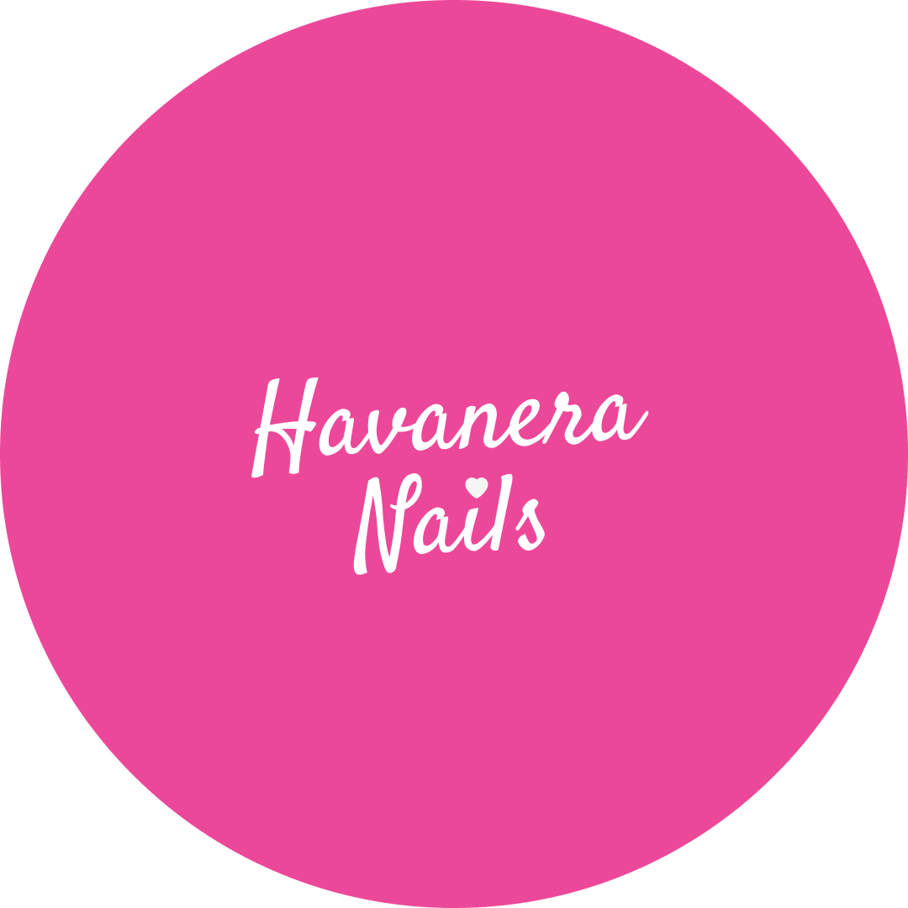

# Havanera Nails Salon - Sitio Web Oficial



Un sitio web moderno y elegante para Havanera Nails Salon, un centro especializado en servicios de manicura y pedicura de alta calidad ubicado en Miramar, La Habana. El sitio está construido con tecnologías de última generación para garantizar rendimiento, accesibilidad y una experiencia de usuario excepcional.

## ✨ Características principales

- **Diseño responsive** optimizado para móviles, tablets y desktop
- **Estética elegante** con paleta de colores en tonos rosa y elementos visuales modernos
- **Catálogo de diseños** con galería interactiva y lightbox
- **Sección de servicios** detallada con precios y descripciones
- **Sistema de reservas** con integración directa a WhatsApp
- **Sección de FAQ** con respuestas a preguntas frecuentes
- **Página 404 personalizada** que mantiene al usuario en el sitio
- **Optimización SEO** con metadatos y datos estructurados
- **Alto rendimiento** con imágenes optimizadas y carga progresiva
- **Accesibilidad** siguiendo las mejores prácticas WCAG

## 🚀 Tecnologías

- [Astro](https://astro.build/) - Framework web de alto rendimiento con enfoque en contenido estático
- [TypeScript](https://www.typescriptlang.org/) - Superset tipado de JavaScript para mayor robustez
- [Tailwind CSS](https://tailwindcss.com/) - Framework CSS utilitario para diseño rápido y consistente
- [ESLint](https://eslint.org/) - Herramienta de linting para mantener la calidad del código
- [Prettier](https://prettier.io/) - Formateador de código para mantener la consistencia

## 📋 Requisitos previos

- Node.js (v18.x o superior)
- npm o yarn

## 🔧 Instalación

1. Clona este repositorio:

```bash
git clone https://github.com/thejasondev/havanera-nails-salon.git
cd havanera-nails-salon
```

2. Instala las dependencias:

```bash
npm install
```

## 🛠️ Desarrollo

Para iniciar el servidor de desarrollo:

```bash
npm run dev
```

El sitio estará disponible en: `http://localhost:4321`

### Scripts disponibles

- `npm run dev` - Inicia el servidor de desarrollo con hot-reloading
- `npm run build` - Compila el proyecto para producción optimizando todos los recursos
- `npm run preview` - Vista previa de la compilación de producción localmente
- `npm run lint` - Ejecuta ESLint para verificar la calidad del código
- `npm run format` - Formatea el código con Prettier
- `npm run typecheck` - Verifica los tipos con TypeScript

## 📦 Estructura del proyecto

```
/
├── public/          # Activos estáticos (imágenes, favicon, etc.)
│   ├── arreglos/    # Imágenes del catálogo
│   ├── bg-top/      # Imágenes de fondo
│   ├── favicon/     # Iconos del sitio
│   ├── svg/         # Gráficos vectoriales
│   └── logo.png     # Logo principal
├── src/
│   ├── components/  # Componentes reutilizables
│   │   ├── Header.astro    # Navegación principal
│   │   ├── Footer.astro    # Pie de página
│   │   ├── Hero.astro      # Banner principal
│   │   ├── Catalogo.astro  # Galería de diseños
│   │   ├── Servicio.astro  # Lista de servicios
│   │   ├── Contacto.astro  # Formulario de contacto
│   │   └── Reserva.astro   # Sistema de reservas
│   ├── layouts/     # Plantillas de diseño
│   │   └── Layout.astro    # Diseño principal
│   ├── pages/       # Páginas del sitio
│   │   ├── index.astro            # Página principal
│   │   ├── Catalogo_section.astro # Página del catálogo
│   │   ├── Servicio_section.astro # Página de servicios
│   │   ├── FAQ_section.astro      # Página de preguntas frecuentes
│   │   └── 404.astro              # Página de error 404
│   ├── scripts/     # Scripts TypeScript
│   └── styles/      # Estilos globales
├── astro.config.ts  # Configuración de Astro
├── tailwind.config.ts # Configuración de Tailwind CSS
├── tsconfig.json    # Configuración de TypeScript
└── package.json     # Dependencias y scripts
```

## 🚀 Despliegue

Para construir el sitio para producción:

```bash
npm run build
```

Los archivos compilados se encontrarán en la carpeta `dist/` y estarán listos para desplegarse en cualquier hosting estático como Vercel, Netlify, GitHub Pages, etc.

### Rendimiento y optimización

El sitio está optimizado para obtener las mejores puntuaciones en Lighthouse:

- Imágenes en formato WebP y con tamaños optimizados
- Carga diferida (lazy loading) para contenido bajo el pliegue
- Precarga de recursos críticos
- Código CSS y JavaScript minimizado
- Caché adecuado para recursos estáticos

## 📱 Características móviles

- Diseño "mobile-first" para una experiencia óptima en dispositivos pequeños
- Menú de navegación adaptativo
- Optimización de imágenes para conexiones móviles
- Elementos interactivos dimensionados para facilitar el uso táctil
- Tiempos de carga rápidos en dispositivos móviles

## 🔍 SEO y accesibilidad

- Metadatos optimizados para motores de búsqueda
- Datos estructurados (JSON-LD) para una mejor indexación
- Mapa del sitio XML para facilitar el rastreo
- Etiquetas alt descriptivas en todas las imágenes
- Navegación por teclado habilitada
- Contraste adecuado para mejor legibilidad
- Atributos ARIA cuando son necesarios

## 🤝 Contribución

Las contribuciones son bienvenidas. Para contribuir:

1. Haz un fork del proyecto
2. Crea una rama para tu característica (`git checkout -b feature/nueva-caracteristica`)
3. Haz commit de tus cambios (`git commit -m 'Agrega nueva característica'`)
4. Haz push a la rama (`git push origin feature/nueva-caracteristica`)
5. Abre un Pull Request

### Estándares de código

- Sigue las reglas de linting configuradas en ESLint
- Formatea el código con Prettier antes de cada commit
- Mantén el código TypeScript tipado correctamente

## 📈 Análisis y seguimiento

El sitio incluye integración para análisis de tráfico y seguimiento de conversiones, permitiendo medir:

- Páginas más visitadas
- Tasas de conversión de reservas
- Dispositivos más utilizados por los usuarios
- Fuentes de tráfico principales

## 🌐 Redes sociales

El sitio incluye enlaces a las redes sociales oficiales de Havanera Nails:

- Instagram: [@havanera*nails*](https://www.instagram.com/havanera_nails_)
- WhatsApp: +5355118387

## 📄 Licencia

Este proyecto está bajo la licencia [MIT](LICENSE).

---

Desarrollado para Havanera Nails Salon por Jason Guerra.
